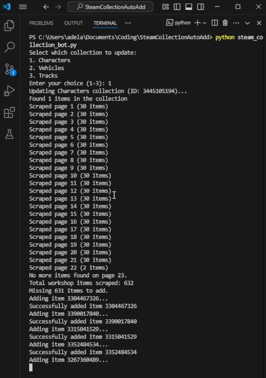

# The Karters 2: Turbo Charged Workshop Auto-Add

A Python automation script mainly designed for **The Karters 2: Turbo Charged**. The script scrapes the Steam Workshop for items matching specified criteria and automatically adds the missing ones to your designated collection. It can also be adapted for other games and workshop items by modifying the configuration settings.



## Overview

This tool automates the process of keeping your Steam collection up-to-date by:
- Browsing through specific Steam Workshop pages.
- Extracting unique item IDs based on tags.
- Scraping your current collection.
- Adding only the missing items to your collection.

The automation uses Selenium with Microsoft Edge WebDriver, using your existing Edge browser profile for a seamless Steam login experience.

## Features

- **Steam Workshop Integration:** Targets The Karters 2: Turbo Charged Workshop (configurable for other games).
- **Collection Synchronization:** Compares workshop items with your collection and adds only the missing ones.
- **Optimized Navigation:** Handles pagination and improves performance by minimizing delays.
- **Adaptability:** Easy to update URLs and settings via the configuration file (`config.py`).

## Prerequisites

- Python 3.x
- Microsoft Edge browser
- Microsoft Edge WebDriver (matching your Edge version)
- A valid Steam account with an existing collection

## Installation

1. **Clone the repository:**
   ```bash
   git clone https://github.com/adelansari/steam_workshop_collection.git
   cd steam_workshop_collection
   ```

2. **Install required dependencies:**
   ```bash
   pip install selenium
   ```

3. **Download Microsoft Edge WebDriver:**
   Ensure you have the correct version matching your Edge installation. Download it from [Microsoft Edge WebDriver](https://developer.microsoft.com/en-us/microsoft-edge/tools/webdriver/).

## Configuration

This project consists of two main files:

  - **config.py:** Centralizes configuration settings. Update the following variables as needed:
  - `EDGE_PROFILE_PATH`: Path to your Edge user data profile.
  - `EDGE_DRIVER_PATH`: Path to your Edge WebDriver executable.
  - `COLLECTION_IDS`: Dictionary mapping collection names (e.g., "Characters", "Vehicles", "Tracks") to their Steam collection IDs.
  - **Cache Storage:** Cache files are now stored per tag in the `cache/` folder, with each tag in its own JSON file. You can clear or inspect these files independently.
  - `WORKSHOP_BASE_URL` & `SHARED_FILE_DETAILS_URL`: Base URLs for Steam Workshop and shared file details. Update as appropriate to target other games.

- **steam_collection_bot.py:** Contains the main logic that:
  - Prompts you to select a collection.
  - Scrapes current workshop and collection items.
  - Adds missing items to your collection.

## Usage

1. **Ensure you are logged into Steam** via your Microsoft Edge profile.
2. **Run the script:**
   ```bash
   python steam_collection_bot.py
   ```
3. **Follow the prompt** to select which collection to update. The script will then:
   - Launch Edge using your configured profile.
   - Scrape the Workshop for items tagged for The Karters 2: Turbo Charged.
   - Compare scraped items with your current collection.
   - Automatically add missing items to your collection.
   - Exit once completed.

## Auto-run the subscription script before launching the game

To automate subscription before starting **The Karters 2**, configure Steam to run the following batch wrapper instead of the game directly:

- Create a batch file named `run_subscribe_and_game.bat` in this folder (already provided).
- Set Steam Launch Options to:

```
"C:\Users\adela\Documents\Coding\SteamCollectionAutoAdd\run_subscribe_and_game.bat" "%command%"
```

This will first execute `subscribe_collection.py` and then launch the game.

## Adaptation

While this tool is tailored for **The Karters 2: Turbo Charged**, you can easily adapt it for other games by updating the configuration settings in `config.py`, particularly:
- Changing `WORKSHOP_BASE_URL` to match the target game's Steam Workshop URL.
- Updating `COLLECTION_IDS` to correspond with the correct Steam collection for the new game.

Enjoy automating your Steam collection updates!