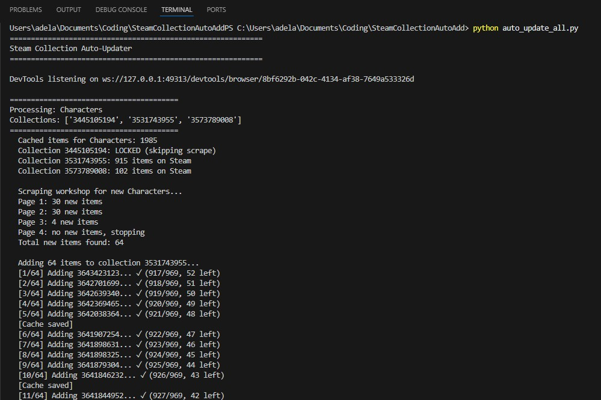
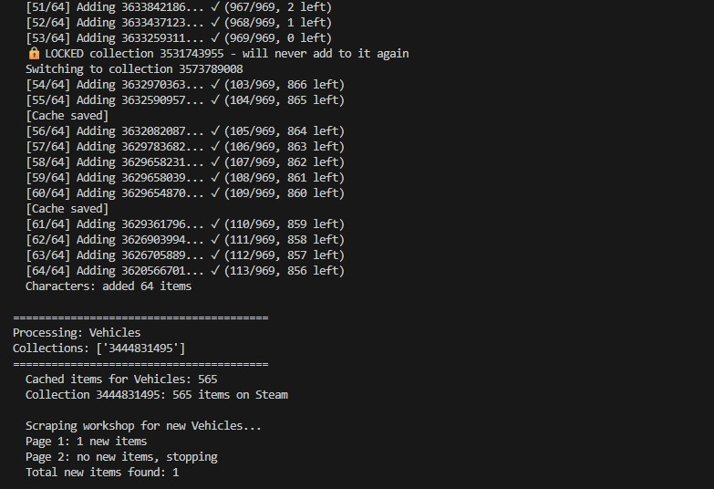

# Steam Workshop Collection Auto-Add

Automatically keep your Steam Workshop collections in sync with new uploads. Originally built for **The Karters 2: Turbo Charged**, but adaptable to any Steam game.

<!--  -->



## Features

- **Automatic filling**: Scrapes Workshop for new items and adds them to your collections
- **Multi-collection support**: When one collection fills up, automatically moves to the next
- **Permanent locking**: Once a collection reaches the limit, it's locked forever (no accidental overwrites)
- **Crash-safe**: Saves progress every 5 items and on exit
- **Smart caching**: Cache only grows, never shrinks (handles hidden/removed items gracefully)
- **Git integration**: Auto-commits and pushes changes after each run

## How It Works

```
For each tag (Characters, Vehicles, etc.):
1. Skip LOCKED collections entirely
2. Scrape unlocked collections to update cache
3. Scrape Workshop for new items (most recent first)
4. Add new items to the first collection with capacity
5. When collection fills → LOCK it → switch to next
6. Save cache and commit to git
```

## Prerequisites

- Python 3.x
- Microsoft Edge + [Edge WebDriver](https://developer.microsoft.com/en-us/microsoft-edge/tools/webdriver/)
- Steam account with collections

## Installation

```bash
git clone https://github.com/adelansari/steam_workshop_collection.git
cd steam_workshop_collection
pip install selenium
```

## Configuration

### `config.py`

```python
# Hard cap per collection (Steam's practical limit)
MAX_COLLECTION_ITEMS = 969

# Map of tag → list of collection IDs (filled in order)
COLLECTION_IDS = {
    "Characters": ["3445105194", "3531743955", "3573789008"],
    "Vehicles": ["3444831495"],
    "Tracks": ["3445118133"],
    "Wheels": ["3530392942"],
}

# Path to Edge WebDriver
EDGE_DRIVER_PATH = r"C:\EdgeDriver\msedgedriver.exe"
```

### `locked_collections.json`

Collections that have reached capacity and should never be touched again:

```json
[
  "3445105194",
  "3531743955"
]
```

To unlock a collection, remove its ID from this file.

## Usage

```bash
python auto_update_all.py
```

### Example Output

```
============================================================
Steam Collection Auto-Updater
============================================================

========================================
Processing: Characters
Collections: ['3445105194', '3531743955', '3573789008']
========================================
  Collection 3445105194: LOCKED (skipping scrape)
  Collection 3531743955: LOCKED (skipping scrape)
  Collection 3573789008: 245 items on Steam
  Cached items for Characters: 2183

  Scraping workshop for new Characters...
  Page 1: 12 new items
  Page 2: no new items, stopping
  Total new items found: 12

  Adding 12 items to collection 3573789008...
  [1/12] Adding 3642197893... ✓ (246/969, 723 left)
  [2/12] Adding 3641985234... ✓ (247/969, 722 left)
  ...
  [Cache saved]
  Characters: added 12 items

Saving cache...
Git: committed and pushed (update: Characters:3573789008+12)

============================================================
Done! Total added: 12
============================================================
```

## File Structure

```
├── auto_update_all.py          # Main script (run this)
├── steam_collection_bot.py     # Core functions
├── config.py                   # Configuration
├── locked_collections.json     # Permanently full collections
└── cache/
    ├── Characters/
    │   ├── 3445105194.json     # Item IDs in collection 1
    │   ├── 3531743955.json     # Item IDs in collection 2
    │   └── 3573789008.json     # Item IDs in collection 3
    ├── Vehicles/
    │   └── 3444831495.json
    └── ...
```

## Key Behaviors

| Scenario | Behavior |
|----------|----------|
| Collection reaches 969 items | Automatically locked, switches to next |
| Scrape fails (timeout) | Uses cached data, doesn't wipe |
| Items hidden/removed from Workshop | Cache keeps them (never shrinks) |
| Script crashes mid-run | Progress saved every 5 items |
| Ctrl+C interrupt | Saves all progress before exit |
| All collections full | Stops with warning, no errors |

## Adapting for Other Games

1. Update `WORKSHOP_BASE_URL` in `config.py` to the new game's Workshop
2. Update `COLLECTION_IDS` with your collection IDs
3. Adjust `MAX_COLLECTION_ITEMS` if needed

## Auto-run Before Game Launch

Add to Steam Launch Options:

```
"C:\path\to\run_subscribe_and_game.bat" "%command%"
```

This runs the sync script before launching the game.
