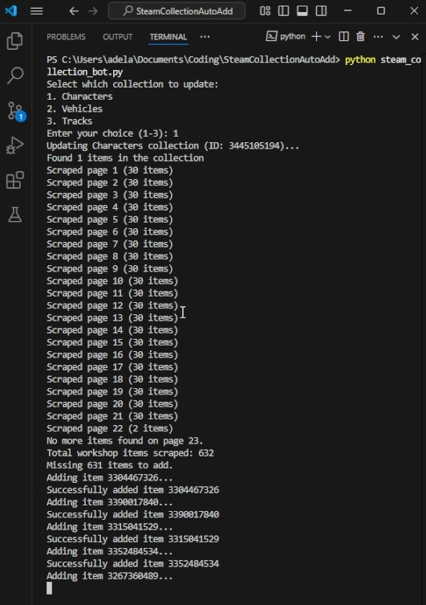
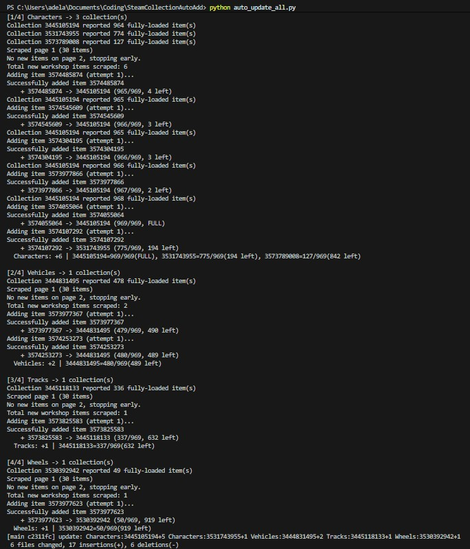

# The Karters 2: Turbo Charged Workshop Auto-Add

A Python automation script mainly designed for **The Karters 2: Turbo Charged**. The script scrapes the Steam Workshop for items matching specified criteria and automatically adds the missing ones to your designated collection. It can also be adapted for other games and workshop items by modifying the configuration settings.




## Overview

This tool automates keeping multiple Steam Workshop collections in sync with the newest uploads for configured tags. It:
- Loads every configured collection for a tag (with full lazy-load scrolling) to get an accurate current item set.
- Scrapes the Workshop (most recent first) and stops as soon as it reaches a page containing only already-known items (early stopping for speed).
- Computes which scraped items are not yet present in any of the tag's collections.
- Adds those missing items while balancing across multiple collections, always respecting a hard per‑collection cap (`MAX_COLLECTION_ITEMS`).
- Saves lightweight per‑collection cache files for fast subsequent runs.

The automation uses Selenium with Microsoft Edge WebDriver, using your existing Edge browser profile for a seamless Steam login experience.

## Features

- **Accurate Collection Counting:** Scrolls to fully load lazy-loaded items before counting.
- **Per‑Collection Hard Limit:** Respects `MAX_COLLECTION_ITEMS` (e.g. 969) and avoids overshoot via near‑limit revalidation.
- **Balanced Distribution:** Chooses the collection with the most remaining capacity instead of filling one fully first.
- **Early Stop Workshop Scrape:** Stops paging once a page contains no new IDs, avoiding unnecessary deep history fetches.
- **Per‑Collection Caching:** One JSON file per collection; simple, fast, and scalable to thousands of items.
- **Configurable & Game-Agnostic:** Adjust a few constants to target another game's Workshop tags and collections.

## Prerequisites

- Python 3.x
- Microsoft Edge browser
- Microsoft Edge WebDriver (matching your Edge version)
- A valid Steam account with an existing collection

## Installation

1. **Clone the repository:**
   ```bash
   git clone https://github.com/adelansari/steam_workshop_collection.git
   cd steam_workshop_collection
   ```

2. **Install required dependencies:**
   ```bash
   pip install selenium
   ```

3. **Download Microsoft Edge WebDriver:**
   Ensure you have the correct version matching your Edge installation. Download it from [Microsoft Edge WebDriver](https://developer.microsoft.com/en-us/microsoft-edge/tools/webdriver/).

## Configuration

Key files:

### `config.py`
Edit these values:
- `MAX_COLLECTION_ITEMS`: Hard cap per Steam collection (e.g. 969). Script will not add beyond this.
- `COLLECTION_IDS`: Map of tag -> list of Steam collection IDs. Example:
   ```python
   COLLECTION_IDS = {
         "Characters": ["3445105194", "3531743955"],
         "Vehicles": ["3444831495"],
         "Tracks": ["3445118133"],
         "Wheels": ["3530392942"],
   }
   ```
- `EDGE_DRIVER_PATH`: Path to `msedgedriver.exe`.
- `WORKSHOP_BASE_URL` and `SHARED_FILE_DETAILS_URL`: Adjust for other games.

### Cache Layout
Fresh runs create:
```
cache/
   Characters/
      3445105194.json
      3531743955.json
   Vehicles/
      3444831495.json
   Tracks/
      3445118133.json
   Wheels/
      3530392942.json
```
Each file = JSON array of item ID strings currently tracked for that collection. You may delete any file/folder to force a re-sync for that specific collection without affecting others.

### `steam_collection_bot.py`
Interactive single-tag updater. Prompts for a tag, then syncs missing items into that tag's collections.

### `auto_update_all.py`
Batch mode: iterates all tags in `COLLECTION_IDS` and performs the same sync logic unattended (use in scheduled tasks / cron / Windows Task Scheduler).

## Usage

Interactive (single tag):
```bash
python steam_collection_bot.py
```
Batch (all tags):
```bash
python auto_update_all.py
```

Workflow per tag:
1. Load all configured collections for the tag (fully scroll to count accurately).
2. Union their item IDs (baseline set of known IDs).
3. Scrape Workshop pages (most recent first) until a page yields zero new IDs.
4. Determine missing IDs (not in any collection yet).
5. Add them, choosing the collection with the most remaining capacity each time.
6. Near the limit (<=25 slots), re-fetch that collection to guard against lazy-load undercounts.
7. Persist per-collection JSON files.

Stopping conditions:
- All collections for the tag reach `MAX_COLLECTION_ITEMS`, or
- No new Workshop items found beyond what you already have.

If a collection is already over the configured limit (e.g., due to past manual additions), the script skips adding to it and logs a warning—you can manually trim if needed.

## Internal Workflow Details

This section documents the precise logic the scripts follow (useful for auditing or extending):

### 1. First Run (no cache present)
1. `load_cache()` returns an empty dict.
2. Each collection ID for the selected tag is loaded via `get_collection_items()` (the page is scrolled until item count stabilizes).
3. A union of all currently present item IDs becomes the baseline `prev_items`.
4. Workshop pages are scraped (most recent first). For each page:
    - Extract all item IDs.
    - Compute `new_ids = page_ids - prev_items`.
    - If `new_ids` is empty, stop immediately (early stop).
5. Usually on a genuine first run nothing new is added because your collections already contain everything seen on the newest pages.
6. Per‑collection JSON cache files are written.

### 2. Determining “Missing” Items
- `workshop_items` accumulates every newly seen ID until the early stop.
- `total_current` = union of item IDs across all managed collections for the tag.
- `missing_items = [id for id in workshop_items if id not in total_current]`.
   (Normally identical to `workshop_items` unless something was just manually added.)

### 3. Multiple Collections Handling
- All collections are loaded before any additions.
- For each missing item the script picks the collection with the largest remaining capacity (`MAX_COLLECTION_ITEMS - current_count`).
- Near limit (<=25 remaining) it re-fetches that collection to correct for any lazy‑load undercount before deciding further additions.
- If all collections are at or above the limit, additions stop.

### 4. Limit Enforcement
- The selector never returns a collection with zero remaining capacity.
- Near-limit refresh prevents overshooting due to partially loaded DOM states.
- If after refresh the collection is at/over the cap it is excluded from further additions.

### 5. When Workshop Scraping Stops
Scraping halts when any of these occurs:
- A "no items" marker appears.
- Page load times out.
- First page where every ID is already known (`page_ids - prev_items` is empty).

Implication: Historical gaps older than the first fully-known page are not revisited (forward-only mode). Removing items from collections does not force backfill unless you also clear the relevant cache JSONs.

### 6. Cache After a Run
`cache/<Tag>/<CollectionID>.json` for each managed collection—each contains a sorted JSON list of that collection's item IDs. Deleting a specific file forces a re-scan of only that collection next run.

### 7. Summary Flow (Per Tag)
1. Load existing per‑collection sets.
2. Union them for baseline.
3. Scrape recent pages until a page has zero new IDs.
4. Filter to items not already in any collection.
5. Add items to the collection with the most remaining capacity.
6. Revalidate counts near cap.
7. Save updated per‑collection JSONs.


## Auto-run the subscription script before launching the game

To automate subscription before starting **The Karters 2**, configure Steam to run the following batch wrapper instead of the game directly:

- Create a batch file named `run_subscribe_and_game.bat` in this folder (already provided).
- Set Steam Launch Options to:

```
"C:\Users\adela\Documents\Coding\SteamCollectionAutoAdd\run_subscribe_and_game.bat" "%command%"
```

This will first execute `subscribe_collection.py` and then launch the game.

## Adaptation

To adapt for another game:
- Update `WORKSHOP_BASE_URL` to the new app's Workshop browse URL and adjust required tag parameter if different.
- Set the new collection IDs in `COLLECTION_IDS` for the relevant tags.
- Adjust `MAX_COLLECTION_ITEMS` if the target game’s practical collection limit differs.

Optional enhancements you could add:
- Historical deep backfill (continue N extra pages past first all-known page).
- Collection trim utility for over-limit repair.
- Summary report (counts + newly added IDs) per run.

Enjoy automating your Steam Workshop collections!